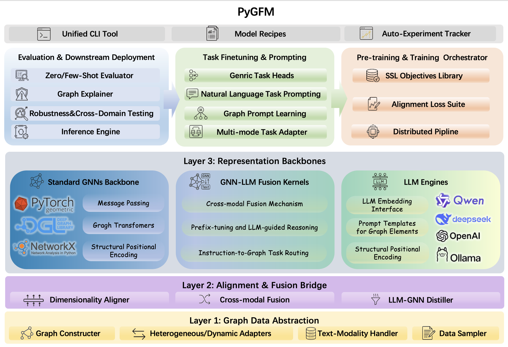

<div align="center">


---

`pygfm` is a unified Python toolkit for **Graph Foundation Model (GFM)** research. It integrates **19 state-of-the-art baseline methods** under a single, pip-installable package with shared utilities, standardized interfaces, and fully reproducible experiment pipelines.

Developed by **Beihang University · School of Computer Science and Engineering · ACT Lab · MAGIC GROUP**.

## Framework Overview

<div align="center">
  
</div>

PyGFM is organized into four stacked layers — **Graph Data Abstraction → Alignment & Fusion Bridge → Representation Backbones → Task Heads & Orchestration** — with a unified CLI, model recipes, and an auto-experiment tracker sitting on top.

## Highlights

- **One package, 19 baselines** — prompt-based GFMs, structure-aware models, LLM-integrated approaches, and retrieval-augmented methods all available via a single `pip install`.
- **Reproducible pipelines** — every baseline ships with YAML-driven experiment configs, training scripts, and evaluation helpers.
- **Shared backbone library** — common GNN encoders, loss functions, and data utilities are factored out and reused across all baselines, reducing code duplication.
- **CLI-first design** — launch pre-training, fine-tuning, and evaluation jobs directly from the command line without writing any boilerplate.
- **LLM-ready** — first-class support for LLM-integrated GFMs (GraphGPT, GraphText, LLaGA, OneForAll) with HuggingFace-compatible YAML configs.

## Installation

### Minimal install (utilities only)

```bash
pip install python-gfm
```

### With PyTorch + PyG (recommended for running experiments)

```bash
# 1. Install PyTorch with CUDA 12.8 support
pip install torch==2.8.0 --index-url https://download.pytorch.org/whl/cu128

# 2. Install pygfm with the full ML stack (PyG extensions are resolved automatically)
pip install "python-gfm[torch]" -f https://data.pyg.org/whl/torch-2.8.0+cu128.html
```

> **CPU-only machines:** replace the CUDA index URLs with `https://download.pytorch.org/whl/cpu` and `https://data.pyg.org/whl/torch-2.8.0+cpu.html` respectively.

### Development install (full checkout with experiment scripts)

```bash
git clone <repo-url> && cd pygfm
pip install -e ".[torch,dev]"
```

The `dev` extra adds `pytest` and `ruff` for testing and linting.

## Quick Start

```python
import pygfm

print(pygfm.__version__)
```

Run a pre-training job from the CLI:

```bash
# SA2GFM contrastive pre-training
gfm-sa2gfm-pretrain -c scripts/sa2gfm/configs/pretrain.yaml

# SA2GFM downstream fine-tuning
gfm-sa2gfm-downstream -c scripts/sa2gfm/configs/downstream.yaml
```

## Package Structure

```
pygfm/
├── src/pygfm/
│   ├── baseline_models/   # 19 GFM baseline implementations
│   ├── public/            # Shared utilities, losses, and backbone encoders
│   │   ├── backbone_models/
│   │   ├── utils/
│   │   └── cli/
│   ├── private/           # Core encoders and internal data generation
│   └── cli/               # Console entry points
└── scripts/               # Per-baseline experiment scripts and configs
    ├── <baseline>/
    │   ├── README.md
    │   ├── configs/
    │   ├── pretrain.py / downstream.py / ...
    │   └── eval_script/
```

## Supported Baselines

| Category                          | Methods                                                         |
| --------------------------------- | --------------------------------------------------------------- |
| **Prompt-based GFM**        | MDGPT, SAMGPT, MDGFM, GraphPrompt, HGPrompt, MultiGPrompt, GCoT |
| **Structure-aware GFM**     | SA2GFM, Bridge, GraphKeeper, GraphMore, Graver, BIM-GFM, GCOPE  |
| **LLM-integrated GFM**      | GraphGPT, GraphText, LLaGA, OneForAll                           |
| **Retrieval-augmented GFM** | RAG-GFM                                                         |
| **Classic Baseline**        | Classic GNN                                                     |

## Running Experiments

All scripts are under `scripts/<baseline>/` and should be run from the repository root.

```bash
# Prompt-based: MDGPT pre-training
python scripts/mdgpt/pretrain.py

# Structure-aware: SA2GFM downstream fine-tuning
python scripts/sa2gfm/downstream.py

# LLM-integrated: GCoT full pipeline
python scripts/gcot/pretrain.py
python scripts/gcot/finetune.py
python scripts/gcot/finetune_graph.py

# LLM-integrated: GraphGPT (YAML-driven HuggingFace-style training)
python scripts/graphgpt/run_with_config.py -c scripts/graphgpt/configs/train_mem_template.yaml
```

## Console Commands

After installation the following CLI entry points are registered:

| Command                   | Description                                       |
| ------------------------- | ------------------------------------------------- |
| `pygfm` / `gfm`       | Generic YAML-driven runner (`-c <config.yaml>`) |
| `gfm-sa2gfm-pretrain`   | SA2GFM contrastive pre-training                   |
| `gfm-sa2gfm-downstream` | SA2GFM MoE downstream fine-tuning                 |

## Configuration

All experiment hyperparameters are stored as YAML files under `scripts/<baseline>/configs/`. Pass configs via the `-c` flag:

```bash
python scripts/<baseline>/pretrain.py -c scripts/<baseline>/configs/default.yaml
```

**API keys:** baselines that call external LLM APIs (e.g., GraphText) read credentials from a local env file. **Never commit API keys to the repository.** Copy the example template and fill in your keys:

```bash
cp scripts/graphtext/config/user/env.yaml.example scripts/graphtext/config/user/env.yaml
# Then edit env.yaml and add your API key
```

## Baseline Documentation

Each baseline ships a dedicated README with setup instructions, data preparation steps, and evaluation notes:

| Baseline     | Docs                                                            |
| ------------ | --------------------------------------------------------------- |
| MDGPT        | [scripts/mdgpt/README.md](scripts/mdgpt/README.md)               |
| SA2GFM       | [scripts/sa2gfm/README.md](scripts/sa2gfm/README.md)             |
| SAMGPT       | [scripts/samgpt/README.md](scripts/samgpt/README.md)             |
| MDGFM        | [scripts/mdgfm/README.md](scripts/mdgfm/README.md)               |
| GraphPrompt  | [scripts/graphprompt/README.md](scripts/graphprompt/README.md)   |
| HGPrompt     | [scripts/hgprompt/README.md](scripts/hgprompt/README.md)         |
| MultiGPrompt | [scripts/multigprompt/README.md](scripts/multigprompt/README.md) |
| GCoT         | [scripts/gcot/README.md](scripts/gcot/README.md)                 |
| Graver       | [scripts/graver/README.md](scripts/graver/README.md)             |
| GraphMore    | [scripts/graphmore/README.md](scripts/graphmore/README.md)       |
| Bridge       | [scripts/bridge/README.md](scripts/bridge/README.md)             |
| GraphKeeper  | [scripts/graphkeeper/README.md](scripts/graphkeeper/README.md)   |
| GraphGPT     | [scripts/graphgpt/README.md](scripts/graphgpt/README.md)         |
| GraphText    | [scripts/graphtext/README.md](scripts/graphtext/README.md)       |
| LLaGA        | [scripts/llaga/README.md](scripts/llaga/README.md)               |
| OneForAll    | [scripts/oneforall/README.md](scripts/oneforall/README.md)       |
| RAG-GFM      | [scripts/rag_gfm/README.md](scripts/rag_gfm/README.md)           |
| GCOPE        | [scripts/gcope/README.md](scripts/gcope/README.md)               |

## Requirements

| Dependency        | Version                       |
| ----------------- | ----------------------------- |
| Python            | ≥ 3.12                       |
| PyTorch           | 2.8.0 (CUDA 12.8 recommended) |
| PyTorch Geometric | ≥ 2.3.0                      |
| Transformers      | ≥ 4.36.0                     |
| Accelerate        | ≥ 0.26.0                     |

See [`pyproject.toml`](pyproject.toml) for the full dependency specification.

## License

This project is licensed under the **[Apache License 2.0](LICENSE)**.

## Team

**MAGIC GROUP** — Beihang University, School of Computer Science and Engineering, ACT Lab.

---

<div align="center">
<sub>If you find this toolkit useful in your research, please consider starring the repository ⭐</sub>
</div>
